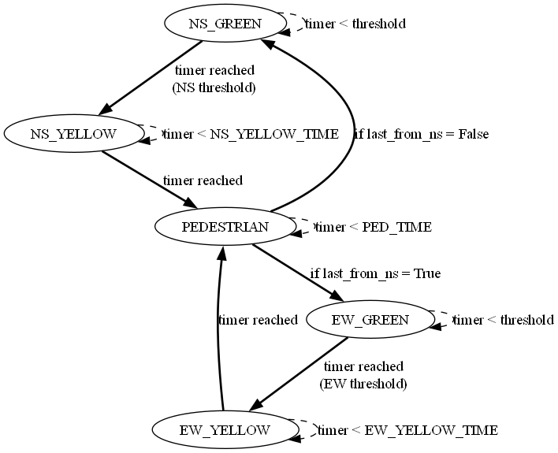
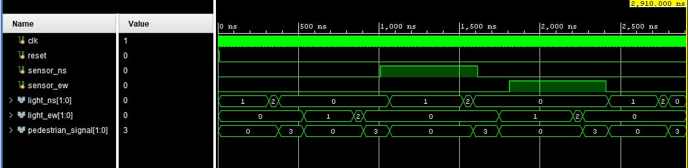

# Traffic Light Controller System Using Verilog HDL
This project implements a traffic light controller for a four-way intersection using Verilog HDL. The system includes timed transitions, pedestrian crossing signals, and a sensor-based traffic management system to handle varying traffic densities.

## Overview
Urban traffic congestion is a growing challenge in modern cities, demanding smarter and more adaptive traffic management solutions. This project presents a Verilog HDL-based traffic light controller, built using a finite state machine (FSM) for a four-way intersection. It efficiently regulates vehicle flow and ensures pedestrian safety using sensor-driven logic and timed signal transitions. The system dynamically adapts to varying traffic densities, minimizing delays and improving overall traffic movement.

## System Components
**Traffic Lights**: Two signal sets manage North-South and East-West traffic, with standard red-yellow-green lights and pedestrian indicators.

**Vehicle Sensors**: Monitor live traffic density across both directions.

**Pedestrian Signal Phase**: Includes a dedicated "scramble crossing" mode where all vehicles are halted, allowing pedestrians to cross in any direction.

## Functionality
The FSM-based controller operates on a predefined timing sequence, enhanced by real-time sensor input. When high traffic is detected in one direction, the green phase is dynamically extended. A pedestrian crossing phase is triggered periodically, ensuring safe passage for all pedestrians while maintaining efficient traffic flow.

## State Diagram

_Visual representation of the FSM controlling traffic signal transitions._

## Simulation Result

_Simulation output showing signal sequencing and pedestrian phase activation._

## Requirements
To simulate and test this Verilog HDL project, you’ll need:
- A Verilog simulator such as ModelSim, Vivado, or Icarus Verilog

- Optional: GTKWave for waveform visualization

- Basic understanding of finite state machines (FSMs) and traffic signal timing logic

 ## Folder Structure
<pre>
verilog_traffic_light/
├── traffic_light_controller.v        # Verilog source file
├── traffic_light_controller_tb.v     # Testbench for simulation
├── fsm_diagram.png                   # FSM state diagram
├── simulation_result.jpeg            # Simulation waveform screenshot
└── README.md                         # Project documentation
</pre>

 
